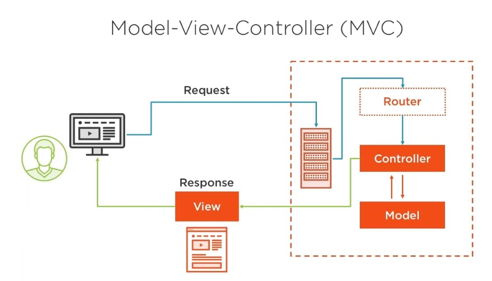

```
<?php 
    $name = 'Hoba';
    echo 'Meteor Name: ' . $name;
?>
```

### Array

* create array 

```
$meteors = array();

$meteors = [];
```

```
$meteors = array('Hoba');
$meteors = ['Hoba'];

$meteors = array('Hoba','Cape York');
```

```
echo($meteors)
print_r($meteors)
```

* append array

```
$meteors[] = 'Campo del Cielo';
$meteors[] = 'Canyon Diablo';

print_r($meteors);
```

* array method

$people = array(
    'David',
    'Jennifer',
    'Falken',
    'Joshua'
);

count($people);
implode(' ',$people);
shuffle($people);
asort($people);

### Associative Meteorite Array

```
$meteors = array(
    'Hoba' => 600000,
    'Cape York' => 3423,
    'Campo del Cielo' => 3435,
    'Canyon Diablo' => 2434
)


foreach($meteors as $name => $weight){
    echo "$name : $weight";
}
```

### Multidimensional Array

```
$games = array(
    'tabletop' => array(
        'sorry',
        'life',
        'scrabble'
    ),
    'card' => array(
        'poker',
        'blackjack'
    )
)

$games['card'];
$games['card'][0] = 'rummy';


print_r($games['card']);
echo $games['tabletop'][0];
```

### Conditional statements 

if( $year ){

} elseif( $year ) {
 
} else {

}

### while loops 

```
    $i = 1;

    while($i <= 12){
        $value = $i * 12;
        echo "<br>$i times 12 is $value";
        $i++;
    }
```

### for loops 

```
   for($i = 1; $i <= 12; $i++){
        $value = $i * 12;
        echo "<br>$i times 12 is $value";
    }

```

* foreach array
```
    foreach($meteors as $meteor){
        echo "<br> $meteor";
    }
```

# Laravel



* install via composer
```
composer create-project laravel/laravel --prefer-dist
composer create-project laravel/laravel <name>
```